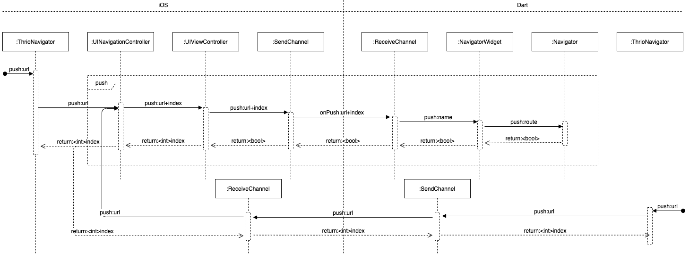

# 如何将 Flutter 无缝的接入现有应用

2019 年是 Flutter 爆发年，我们在业务上为了提升效率也使用了 Flutter，实践下来收获不少惊喜。当然这个过程中也遇到了非常多的问题，其中一个就是如何将 Flutter 无缝接入现有的应用，这大概是我们遇到的最棘手的问题了。在解决这个问题的过程中，我们积累类很多想法，最终开发了 thrio。

在早期 Flutter 发布的时候，谷歌虽然提供了 iOS 和 Android App 上的 Flutter 嵌入方案，但主要针对的是纯 Flutter 的情形，混合开发支持的并不友好。

所谓的纯 RN、纯 weex 应用的生命周期都不存在，所以也不会存在一个纯 Flutter 的 App 的生命周期，因为我们总是有需要复用现有模块。

所以我们需要一套足够完整的 Flutter 嵌入原生 App 的路由解决方案，所以我们自己造了个轮子 [thrio](https://github.com/hellobike/thrio) ，现已开源，遵循 MIT 协议。

## thrio 的设计原则

- 原则一，dart 端最小改动接入
- 原则二，原生端最小侵入
- 原则三，三端保持一致的 API

thrio 所有功能的设计，都会遵守这三个原则。下面会逐步对功能层面一步步展开进行说明，后面也会有原理性的解析。

## thrio 的页面路由

以 dart 中的 `Navigator` 为主要参照，提供以下路由能力：

- push，打开一个页面并放到路由栈顶
- pop，关闭路由栈顶的页面
- popTo，关闭到某一个页面
- remove，删除任意页面

Navigator 中的 API 几乎都可以通过组合以上方法实现，`replace` 方法暂未提供。

不提供 iOS 中存在的 `present` 功能，因为会导致原生路由栈被覆盖，维护复杂度会非常高，如确实需要可以通过修改转场动画实现。

### 页面的索引

要路由到一个页面，我们需要对页面建立索引，通常情况下，我们只需要给每个页面设定一个 `url` 就可以了，如果每个页面都只打开一次的话，不会有任何问题。但是当一个页面被打开多次之后，仅仅通过 url 是无法定位到明确的页面实例的，所以在 `thrio` 中我们增加了页面索引的概念，具体在 API 中都会以 `index` 来表示，同一个 url 第一个打开的页面的索引为 `1` ，之后同一个 `url` 的索引不断累加。

如此，唯一定位一个页面的方式为 `url` + `index`，在 dart 中 `route` 的 `name` 就是由 `'$url.$index'` 组合而成。

很多时候，使用者不需要关注 `index`，只有当需要定位到多开的 `url` 的页面中的某一个时才需要关注 `index`。最简单获取 `index` 的方式为 `push` 方法的回调返回值。

### 页面的 push

1. dart 端打开页面

```dart
ThrioNavigator.push(url: '/biz/biz1/flutter1');
// 传入参数
ThrioNavigator.push(url: '/biz1/native1', params: { '1': {'2': '3'}});
// 是否动画，目前在内嵌的dart页面中动画无法取消，原生iOS页面有效果
ThrioNavigator.push(url: '/biz1/native1', animated:true);
// 接收锁打开页面的关闭回调
ThrioNavigator.push(
    url: '/biz/biz2/flutter2',
    params: {'1': {'2': '3'}},
    poppedResult: (params) => verbose('/biz2/flutter2 popped: $params'),
);
```

2. iOS 端打开页面

```objc
[ThrioNavigator pushUrl:@"/biz/biz1/flutter1"];
// 接收所打开页面的关闭回调
[ThrioNavigator pushUrl:@"/biz/biz2/flutter2" poppedResult:^(id _Nonnull params) {
    ThrioLogV(@"/biz2/flutter2 popped: %@", params);
}];
```

3. Android 端打开页面

```kotlin
ThrioNavigator.push("/biz/biz1/flutter1",
        mapOf("k1" to 1),
        false,
        poppedResult = {
            Log.e("Thrio", "/biz1/native1 popResult call params $it")
        }
)
```

4. 连续打开页面

- dart 端只需要 await push，就可以连续打开页面
- 原生端需要等待 push 的 result 回调返回才能打开第二个页面

5. 获取所打开页面关闭后的回调参数

- 三端都可以通过闭包 poppedResult 来获取

### 页面的 pop

1. dart 端关闭顶层页面

```dart
// 默认动画开启
ThrioNavigator.pop();
// 不开启动画，原生和dart页面都生效
ThrioNavigator.pop(animated: false);
// 关闭当前页面，并传递参数给push这个页面的回调
ThrioNavigator.pop(params: 'popped flutter1'),
```

2. iOS 端关闭顶层页面

```objc
// 默认动画开启
[ThrioNavigator pop];
// 关闭动画
[ThrioNavigator popAnimated:NO];
// 关闭当前页面，并传递参数给push这个页面的回调
[ThrioNavigator popParams:@{@"k1": @3}];
```

3. Android 端关闭顶层页面

```kotlin
ThrioNavigator.pop(params, animated)
```

### 页面的 popTo

1. dart 端关闭到页面

```dart
// 默认动画开启
ThrioNavigator.popTo(url: '/biz/biz1/flutter1');
// 不开启动画，原生和dart页面都生效
ThrioNavigator.popTo(url: '/biz/biz1/flutter1', animated: false);
```

2. iOS 端关闭到页面

```objc
// 默认动画开启
[ThrioNavigator popToUrl:@"/biz/biz1/flutter1"];
// 关闭动画
[ThrioNavigator popToUrl:@"/biz/biz1/flutter1" animated:NO];
```

3. Android 端关闭到页面

```kotlin
ThrioNavigator.popTo(url, index)
```

### 页面的 remove

1. dart 端关闭特定页面

```dart
ThrioNavigator.remove(url: '/biz/biz1/flutter1');
// 只有当页面是顶层页面时，animated参数才会生效
ThrioNavigator.remove(url: '/biz/biz1/flutter1', animated: true);
```

2. iOS 端关闭特定页面

```objc
[ThrioNavigator removeUrl:@"/biz/biz1/flutter1"];
// 只有当页面是顶层页面时，animated参数才会生效
[ThrioNavigator removeUrl:@"/biz/biz1/flutter1" animated:NO];
```

3. Android 端关闭特定页面

```kotlin
ThrioNavigator.remove(url, index)
```

## thrio 的页面通知

页面通知一般来说并不在路由的范畴之内，但我们在实际开发中却经常需要使用到，由此产生的各种模块化框架一个比一个复杂。

那么问题来了，这些模块化框架很难在三端互通，所有的这些模块化框架提供的能力无非最终是一个页面通知的能力，而且页面通知我们可以非常简单的在三端打通。

鉴于此，页面通知作为 thrio 的一个必备能力被引入了 thrio。

### 发送页面通知

1. dart 端给特定页面发通知

```dart
ThrioNavigator.notify(url: '/biz/biz1/flutter1', name: 'reload');
```

2. iOS 端给特定页面发通知

```objc
[ThrioNavigator notifyUrl:@"/biz/biz1/flutter1" name:@"reload"];
```

3. Android 端给特定页面发通知

```kotlin
ThrioNavigator.notify(url, index, params)
```

### 接收页面通知

1. dart 端接收页面通知

使用 `NavigatorPageNotify` 这个 `Widget` 来实现在任何地方接收当前页面收到的通知。

```dart
NavigatorPageNotify(
      name: 'page1Notify',
      onPageNotify: (params) =>
          verbose('flutter1 receive notify: $params'),
      child: Xxxx());
```

2. iOS 端接收页面通知

`UIViewController`实现协议`NavigatorPageNotifyProtocol`，通过 `onNotify` 来接收页面通知

```objc
- (void)onNotify:(NSString *)name params:(id)params {
  ThrioLogV(@"/biz1/native1 onNotify: %@, %@", name, params);
}
```

3. Android 端接收页面通知

`Activity`实现协议`OnNotifyListener`，通过 `onNotify` 来接收页面通知

```kotlin
class Activity : AppCompatActivity(), OnNotifyListener {
    override fun onNotify(name: String, params: Any?) {
    }
}
```

因为 Android activity 在后台可能会被销毁，所以页面通知实现了一个懒响应的行为，只有当页面呈现之后才会收到该通知，这也符合页面需要刷新的场景。

## thrio 的模块化

模块化在 thrio 里面只是一个非核心功能，仅仅为了实现原则二而引入原生端。

thrio 的模块化能力由一个类提供，`ThrioModule`，很小巧，主要提供了 `Module` 的注册链和初始化链，让代码可以根据路由 url 进行文件分级分类。

注册链将所有模块串起来，字母块由最近的父一级模块注册，新增模块的耦合度最低。

初始化链将所有模块需要初始化的代码串起来，同样是为了降低耦合度，在初始化链上可以就近注册模块的页面的构造器，页面路由观察者，页面生命周期观察者等，也可以在多引擎模式下提前启动某一个引擎。

模块间通信的能力由页面通知实现。

```dart
mixin ThrioModule {
    /// A function for registering a module, which will call
    /// the `onModuleRegister` function of the `module`.
    ///
    void registerModule(ThrioModule module);

    /// A function for module initialization that will call
    /// the `onPageRegister`, `onModuleInit` and `onModuleAsyncInit`
    /// methods of all modules.
    ///
    void initModule();

    /// A function for registering submodules.
    ///
    void onModuleRegister() {}

    /// A function for module initialization.
    ///
    void onModuleInit() {}

    /// A function for module asynchronous initialization.
    ///
    void onModuleAsyncInit() {}

    /// Register an page builder for the router.
    ///
    /// Unregistry by calling the return value `VoidCallback`.
    ///
    VoidCallback registerPageBuilder(String url, NavigatorPageBuilder builder);

    /// Register observers for the life cycle of Dart pages.
    ///
    /// Unregistry by calling the return value `VoidCallback`.
    ///
    /// Do not override this method.
    ///
    VoidCallback registerPageObserver(NavigatorPageObserver pageObserver);

    /// Register observers for route action of Dart pages.
    ///
    /// Unregistry by calling the return value `VoidCallback`.
    ///
    /// Do not override this method.
    ///
    VoidCallback registerRouteObserver(NavigatorRouteObserver routeObserver);
}
```

## thrio 的页面生命周期

原生端可以获得所有页面的生命周期，Dart 端只能获取自身页面的生命周期

1. dart 端获取页面的生命周期

```dart
class Module with ThrioModule, NavigatorPageObserver {
  @override
  void onPageObserverRegister() {
    registerPageObserver(this);
  }

  @override
  void didAppear(RouteSettings routeSettings) {}

  @override
  void didDisappear(RouteSettings routeSettings) {}

  @override
  void onCreate(RouteSettings routeSettings) {}

  @override
  void willAppear(RouteSettings routeSettings) {}

  @override
  void willDisappear(RouteSettings routeSettings) {}
}
```

2. iOS 端获取页面的生命周期

```objc
@interface Module1 : ThrioModule<NavigatorPageObserverProtocol>

@end

@implementation Module1

- (void)onPageRegister {
  [self registerPageObserver:self];
}

- (void)onCreate:(NavigatorRouteSettings *)routeSettings { }

- (void)willAppear:(NavigatorRouteSettings *)routeSettings { }

- (void)didAppear:(NavigatorRouteSettings *)routeSettings { }

- (void)willDisappear:(NavigatorRouteSettings *)routeSettings { }

- (void)didDisappear:(NavigatorRouteSettings *)routeSettings { }

@end

```

## thrio 的页面路由观察者

原生端可以观察所有页面的路由行为，dart 端只能观察 dart 页面的路由行为

1. dart 端获取页面的路由行为

```dart
class Module with ThrioModule, NavigatorRouteObserver {
  @override
  void onModuleRegister() {
    registerRouteObserver(this);
  }

  @override
  void didPop(RouteSettings routeSettings) {}

  @override
  void didPopTo(RouteSettings routeSettings) {}

  @override
  void didPush(RouteSettings routeSettings) {}

  @override
  void didRemove(RouteSettings routeSettings) {}
}
```

2. iOS 端获取页面的路由行为

```objc
@interface Module2 : ThrioModule<NavigatorRouteObserverProtocol>

@end

@implementation Module2

- (void)onPageRegister {
  [self registerRouteObserver:self];
}

- (void)didPop:(NavigatorRouteSettings *)routeSettings
 previousRoute:(NavigatorRouteSettings * _Nullable)previousRouteSettings {
}

- (void)didPopTo:(NavigatorRouteSettings *)routeSettings
   previousRoute:(NavigatorRouteSettings * _Nullable)previousRouteSettings {
}

- (void)didPush:(NavigatorRouteSettings *)routeSettings
  previousRoute:(NavigatorRouteSettings * _Nullable)previousRouteSettings {
}

- (void)didRemove:(NavigatorRouteSettings *)routeSettings
    previousRoute:(NavigatorRouteSettings * _Nullable)previousRouteSettings {
}

@end

```

## thrio 支持 Flutter 端自定义转场动画

添加自定义转场动画的示例如下，可以定义正则表达式来作为自定义转场的匹配字符串，只要满足该正字符串的 URL 的都会使用该自定义的转场动画。
需要注意的是，规则先注册先生效。通过正则可以灵活的匹配自己整个模块的所有页面的 URL 或者一个特定的 URL

```dart
class Module
    with
        ThrioModule,
        ModuleRouteTransitionsBuilder,
  @override
  void onRouteTransitionsBuilderRegister() {
    registerRouteTransitionsBuilder(
        '\/biz1\/flutter[0-9]*',
        (
          context,
          animation,
          secondaryAnimation,
          child,
        ) =>
            SlideTransition(
              transformHitTests: false,
              position: Tween<Offset>(
                begin: const Offset(0, -1),
                end: Offset.zero,
              ).animate(animation),
              child: SlideTransition(
                position: Tween<Offset>(
                  begin: Offset.zero,
                  end: const Offset(0, 1),
                ).animate(secondaryAnimation),
                child: child,
              ),
            ));
  }
}
```

## thrio 的额外功能

### iOS 显隐当前页面的导航栏

原生的导航栏在 dart 上一般情况下是不需要的，但切换到原生页面又需要把原生的导航栏置回来，thrio 不提供的话，使用者较难扩展，我之前在目前一个主流的 Flutter 接入库上进行此项功能的扩展，很不流畅，所以这个功能最好的效果还是 thrio 直接内置，切换到 dart 页面默认会隐藏原生的导航栏，切回原生页面也会自动恢复。另外也可以手动隐藏原生页面的导航栏。

```objc
viewController.thrio_hidesNavigationBar = NO;
```

### 支持页面关闭前弹窗确认的功能

如果用户正在填写一个表单，你可能经常会需要弹窗确认是否关闭当前页面的功能。

在 dart 中，有一个 `Widget` 提供了该功能，thrio 完好的保留了这个功能。

```dart
WillPopScope(
    onWillPop: () async => true,
    child: Container(),
);
```

在 iOS 中，thrio 提供了类似的功能，返回 `NO` 表示不会关闭，一旦设置会将侧滑返回手势禁用

```objc
viewController.thrio_willPopBlock = ^(ThrioBoolCallback _Nonnull result) {
  result(NO);
};
```

关于 `FlutterViewController` 的侧滑返回手势，Flutter 默认支持的是纯 Flutter 应用，仅支持单一的 `FlutterViewController` 作为整个 App 的容器，内部已经将 `FlutterViewController` 的侧滑返回手势去掉。但 thrio 要解决的是 Flutter 与原生应用的无缝集成，所以必须将侧滑返回的手势加回来。

## thrio 的设计解析

目前开源 Flutter 嵌入原生的库，主要的还是通过切换 FlutterEngine 上的原生容器来实现的，这是 Flutter 原本提供的原生容器之上最小改动而实现，需要小心处理好容器切换的时序，否则在页面导航时会产生崩溃。基于 Flutter 提供的这个功能， thrio 构建了三端一致的页面管理 API。

### dart 的核心类

dart 端只管理 dart 页面

1. 基于 `RouteSettings` 进行扩展，复用现有的字段

- name = url.index
- isInitialRoute = !isNested
- arguments = params

2. 基于 `MaterialPageRoute` 扩展的 `NavigatorPageRoute`

- 主要提供页面描述和转场动画的是否配置的功能

3. 基于 `Navigator` 扩展，封装 `NavigatorWidget`，提供以下方法

```dart
  Future<bool> push(RouteSettings settings, {
    bool animated = true,
    NavigatorParamsCallback poppedResult,
  });

  Future<bool> pop(RouteSettings settings, {bool animated = true});

  Future<bool> popTo(RouteSettings settings, {bool animated = true});

  Future<bool> remove(RouteSettings settings, {bool animated = false});

```

3. 封装 `ThrioNavigator` 路由 API

```dart
abstract class ThrioNavigator {
    /// Push the page onto the navigation stack.
    ///
    /// If a native page builder exists for the `url`, open the native page,
    /// otherwise open the flutter page.
    ///
    static Future<int> push({
        @required String url,
        params,
        bool animated = true,
        NavigatorParamsCallback poppedResult,
    });

    /// Send a notification to the page.
    ///
    /// Notifications will be triggered when the page enters the foreground.
    /// Notifications with the same `name` will be overwritten.
    ///
    static Future<bool> notify({
        @required String url,
        int index,
        @required String name,
        params,
    });

    /// Pop a page from the navigation stack.
    ///
    static Future<bool> pop({params, bool animated = true})

    static Future<bool> popTo({
        @required String url,
        int index,
        bool animated = true,
    });

    /// Remove the page with `url` in the navigation stack.
    ///
    static Future<bool> remove({
        @required String url,
        int index,
        bool animated = true,
    });
}
```

### iOS 的核心类

1. `NavigatorRouteSettings` 对应于 dart 的 `RouteSettings` 类，并提供相同数据结构

```objc

@interface NavigatorRouteSettings : NSObject

@property (nonatomic, copy, readonly) NSString *url;

@property (nonatomic, strong, readonly) NSNumber *index;

@property (nonatomic, assign, readonly) BOOL nested;

@property (nonatomic, copy, readonly, nullable) id params;

@end

```

2. `NavigatorPageRoute` 对应于 dart 的 `NavigatorPageRoute` 类

- 存储通知、页面关闭回调、NavigatorRouteSettings
- route 的双向链表

3. 基于 `UINavigationController` 扩展，功能类似 dart 的 `NavigatorWidget`

- 提供一些列的路由内部接口
- 并能兼容非 thrio 体系内的页面

4. 基于 `UIViewController` 扩展

- 提供 `FlutterViewController` 容器上的 dart 页面的管理功能
- 提供 popDisable 等功能

5. 封装 `ThrioNavigator` 路由 API

```objc
@interface ThrioNavigator : NSObject

/// Push the page onto the navigation stack.
///
/// If a native page builder exists for the url, open the native page,
/// otherwise open the flutter page.
///
+ (void)pushUrl:(NSString *)url
         params:(id)params
       animated:(BOOL)animated
         result:(ThrioNumberCallback)result
   poppedResult:(ThrioIdCallback)poppedResult;

/// Send a notification to the page.
///
/// Notifications will be triggered when the page enters the foreground.
/// Notifications with the same name will be overwritten.
///
+ (void)notifyUrl:(NSString *)url
            index:(NSNumber *)index
             name:(NSString *)name
           params:(id)params
           result:(ThrioBoolCallback)result;

/// Pop a page from the navigation stack.
///
+ (void)popParams:(id)params
         animated:(BOOL)animated
           result:(ThrioBoolCallback)result;

/// Pop the page in the navigation stack until the page with `url`.
///
+ (void)popToUrl:(NSString *)url
           index:(NSNumber *)index
        animated:(BOOL)animated
          result:(ThrioBoolCallback)result;

/// Remove the page with `url` in the navigation stack.
///
+ (void)removeUrl:(NSString *)url
            index:(NSNumber *)index
         animated:(BOOL)animated
           result:(ThrioBoolCallback)result;

@end
```

### dart 与 iOS 路由栈的结构


1. 一个应用允许启动多个 Flutter 引擎，可让每个引擎运行的代码物理隔离，按需启用，劣势是启动多个 Flutter 引擎可能导致资源消耗过多而引起问题；
2. 一个 Flutter 引擎通过切换可以匹配到多个 FlutterViewController，这是 Flutter 优雅嵌入原生应用的前提条件
3. 一个 FlutterViewController 可以内嵌多个 Dart 页面，有效减少单个 FlutterViewController 只打开一个 Dart 页面导致的内存消耗过多问题，关于内存消耗的问题，后续会有提到。

### dart 与 iOS push 的时序图



1. 所有路由操作最终汇聚于原生端开始，如果始于 dart 端，则通过 channel 调用原生端的 API
2. 通过 `url+index` 定位到页面
3. 如果页面是原生页面，则直接进行相关操作
4. 如果页面是 Flutter 容器，则通过 channel 调用 dart 端对应的路由 API
5. 接 4 步，如果 dart 端对应的路由 API 操作完成后回调，如果成功，则执行原生端的路由栈同步，如果失败，则回调入口 API 的 result
6. 接 4 不，如果 dart 端对应的路由 API 操作成功，则通过 route channel 调用原生端对应的 route observer，通过 page channel 调用原生端对应的 page observer。

### dart 与 iOS pop 的时序图


1. pop 的流程与 push 基本一致；
2. pop 需要考虑页面是否可关闭的问题；
3. 但在 iOS 中，侧滑返回手势会导致问题， `popViewControllerAnimated:` 会在手势开始的时候调用，导致 dart 端的页面已经被 pop 掉，但如果手势被放弃了，则导致两端的页面栈不一致，thrio 已经解决了这个问题，具体流程稍复杂，源码可能更好的说明。

### dart 与 iOS popTo 的时序图


1. popTo 的流程与 push 基本一致；
2. 但在多引擎模式下，popTo 需要处理多引擎的路由栈同步的问题；
3. 另外在 Dart 端，popTo 实际上是多个 pop 或者 remove 构成的，最终产生多次的 didPop 或 didRemove 行为，需要将多个 pop 或 remove 组合起来形成一个 didPopTo 行为。

### dart 与 iOS remove 的时序图


1. remove 的流程与 push 基本一致。

## 总结

目前 Flutter 接入原生应用主流的解决方案应该是[boost](https://github.com/alibaba/flutter_boost)，笔者的团队在项目深度使用过 boost，也积累了很多对 boost 改善的需求，遇到的最大问题是内存问题，每打开一个 Flutter 页面的内存开销基本到了很难接受的程度，[thrio](https://github.com/hellobike/thrio)把解决内存问题作为头等任务，最终效果还是不错的，比如以连续打开 5 个 Flutter 页面计算，boost 的方案会消耗 91.67M 内存，thrio 只消耗 42.76 内存，模拟器上跑出来的数据大致如下：

| demo  | 启动 | 页面 1 | 页面 2 | 页面 3 | 页面 4 | 页面 5 |
| ----- | ---- | ------ | ------ | ------ | ------ | ------ |
| thrio | 8.56 | 37.42  | 38.88  | 42.52  | 42.61  | 42.76  |
| boost | 6.81 | 36.08  | 50.96  | 66.18  | 78.86  | 91.67  |

当然，thrio 跟 boost 的定位还是不太一样的，thrio 更多的偏向于解决我们业务上的需求，尽量做到开箱即用。
