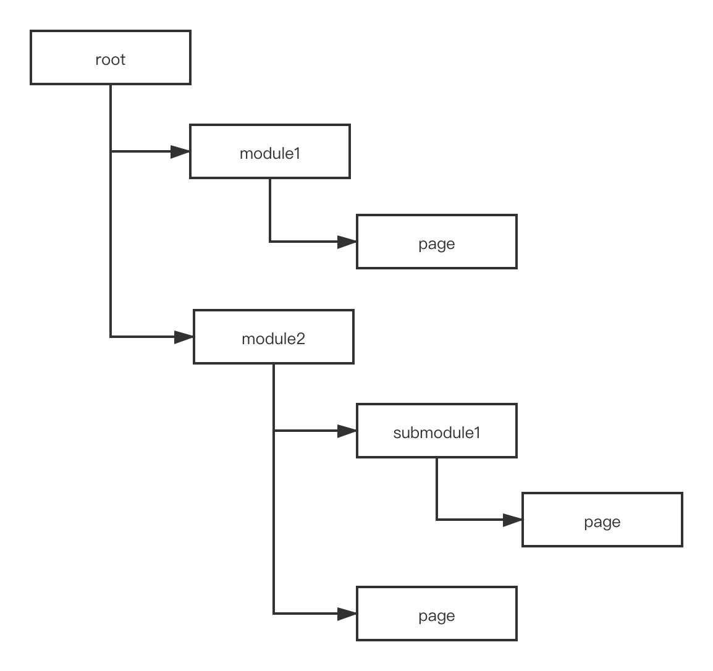
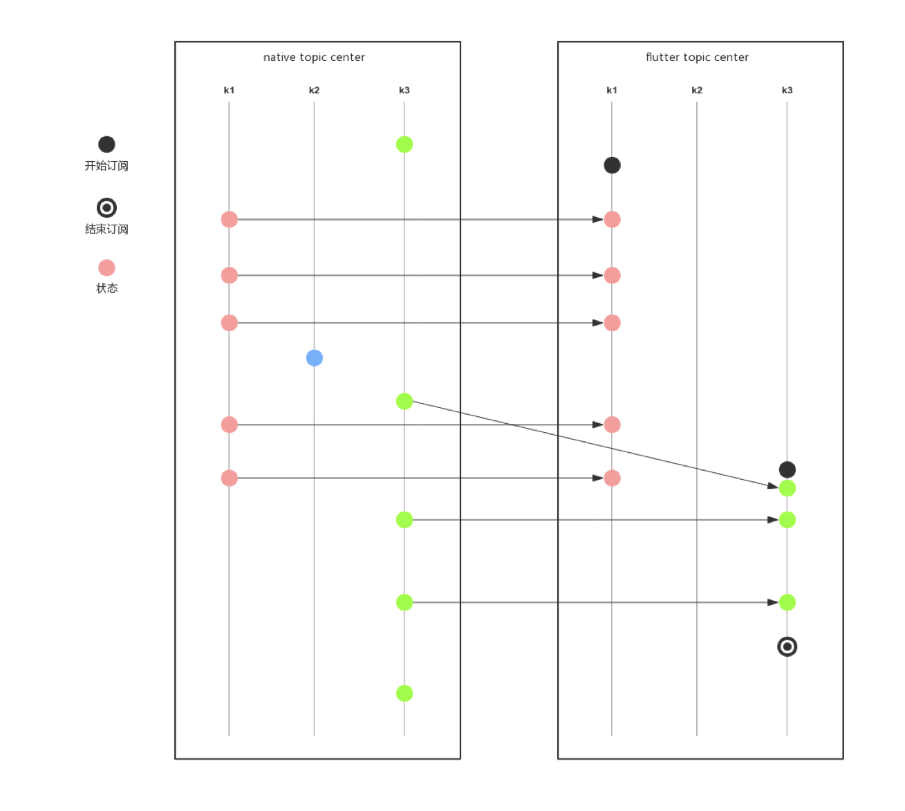
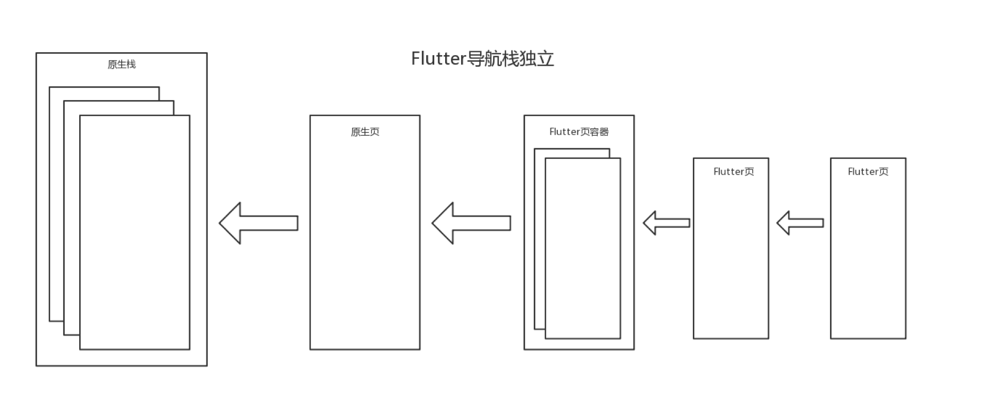
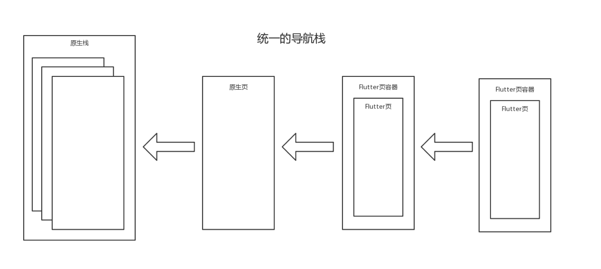

# Flutter 在哈啰出行 B 端创新业务的实践

## 时间线

Flutter 在我们团队的起步算是比较晚的，直到 Flutter 要出 1.0 版本前夕才开始实践。

大概的时间线如下：

- 2018 年 11 月初，在 B 端小范围尝试接入 Flutter；
- 2018 年 12 月 5 日，Flutter 发布了 1.0；
- 2019 年 4 月中旬，开始大范围使用；
- 2019 年 6 月中旬，Flutter 在业务上的效率提升效果开始体现出来；
- 2019 年 7 月中旬，我所在的业务线的 B 端基本上全员转 Flutter 进行移动端开发；
- 2020 年 1 月初，我们用 Flutter 开发了非常多的页面，积累超过 10 万行 Flutter 代码；
- 2020 年 3 月中旬，开源 Flutter 嵌入原生移动 App 混合栈解决方案。

## 实践路线

作为一个创新业务的团队，要做一门全新技术栈的技术储备面临以下几个问题：

- 团队可投入时间少，要保证业务迭代；
- 团队成员没有 Flutter 技术栈的基础；
- 如何验证引入 Flutter 能带来什么业务价值。

这三个问题都是非常现实的问题，如果没有明确的路线规划盲目的引入 Flutter 的，踩坑过多最终会导入投入产出比太低而在业务上无法接受。

我把实践路线主要分一下四个阶段：

- 路线规划
- 技术储备
- 业务验证
- 持续集成

下面介绍在每个阶段我们做了哪些事以及获得的成果和经验。

### 路线规划阶段

**目标设定**：提升人效 50% ~ 100%

**关键行动**：

- 能用 Flutter 进行开发的优先使用 Flutter 来开发，不大范围使用 Flutter 进行开发是很难达成提升人效的目标的；
- Flutter 方案不成熟的直接使用原生开发，避免踩坑过多降低人效，比如地图，存在地图的页面，我们还是直接用原生进行开发；
- 不在早期引入状态管理的库，避免入门成本上升，也避免引入之后代码量变多；
- 团队成员分批入坑 Flutter，不过于保守也不能太过于激进，避免在引入 Flutter 阶段对业务迭代的影响；
- 做好降级，异常监控等稳定性相关的工作。

### 技术储备阶段

#### demo 验证

在技术储备阶段，主要是准备最小可验证的 demo，验证以下几点：

- 验证 Flutter 嵌入现有 iOS 和 Android App 的方案，最终采用 Flutter 官方提供的解决方案；
- 验证 Flutter 包管理中的 **开发模式** 和 **发布模式**，虽然作为创新业务，但哈啰出行的 B 端集合了几乎所有业务线的功能，我们在实践 Flutter 的时候不能影响其它业务线的正常开发，所以我们需要一个发布模式，避免其它的开发者也要安装 Flutter 的开发环境；
- 验证 **包大小**，**内存占用**，以及 **性能** 是否满足，作为创新业务的 B 端 App，在这方面我们可能要求并不高，不做展开；
- 解决 Flutter **异常收集和监控** 的问题，底裤是一定要穿上的，考虑各种方案之后，最终选择 Sentry 作为早期的解决方案；
- 验证 **混合栈** 管理的方案是否可行，最终采纳 flutter_boost 的方案；
- 解决原生和 dart **状态同步** 的问题，为了避免开发过多的插件来做状态的同步，抽象了一个通用的状态同步插件；
- 验证持续集成的方案。

#### 建立规范

没有规范，会增加后续人员的入门成本

- **包和分支管理的规范**，作为一个多业务线的 App，包管理一定要考虑后续其它业务线接入的情况；
- dart **编码规范**，主要是 dart linter 的接入，考量每个规则以及规则之间存在的冲突，解决这些规则上的冲突，因为最终要求每一个 linter 的警告都必须解决掉；
- 建立 **最佳实践** 的积累方式，让团队每个人能避免他人踩过的坑。

#### 人员准备

团队分成两组，先后入坑 Flutter，主要做以下准备：

- 了解 dart 语言，能用 dart 进行基本的页面开发；
- 了解 **开发规范**，包括包和分支管理、编码等规范
- 尽量查阅相关的最佳实践

### 业务验证阶段

#### 降级方案

虽然我们是创新业务，但出于对线上敬畏之心，我们依然准备了降级的方案，一旦 Flutter 上线之后影响到 App 的稳定性，可以随时降级。

所以我们选择了既有的模块，将这些模块用 Flutter 重新开发一遍。同时也为后续的人效对比提供数据支撑。

#### 代码量减少

仅供参考，我们 Flutter 的代码量实践下来会比任何一端的代码量都少一些，相对于 iOS，我们一般是纯代码布局，代码量减少更多。

更少的代码，一定程度上表示更少的 bug，更少的 bug 表示花在修复 bug 上的时间也减少了。

#### 多端一致性

Flutter 渲染的多端一致性，让我们在 UI 布局上所花费的时间更少了。当然早期的 Flutter SDK 在处理字体、光标等方面略有差异，甚至有 bug，但都不是很大的问题。

#### 人效提升

仅供参考，毕竟每个团队的情况不尽相同，业务复杂度也不尽相同。

这里给出我们早期的三个数据的对比，19 年我们下半年的时间基本上进入了纯 Flutter 开发的阶段，但 iOS 和 Android 两端还是需要分别打包、测试、上线，这会一定程度上降低人效提升的百分比，所以我们综合的人效提升会在 90%左右。

| #         | Flutter 人天 | 双端人天 | 人效提升 |
| --------- | ------------ | -------- | -------- |
| 账单管理  | 18.5         | 26       | 40%      |
| 自助还车  | 12.5         | 21       | 68%      |
| 19 年综合 | --           | --       | 90%      |

#### 业务价值

通过引入 Flutter，我们在业务上能更快的进行迭代，使用 Flutter 开发的部分人效提升接近 90% 左右，因为我们总归是有一些功能需要用原生进行开发的，这部分工作量不好做对比。

这达成了我们最初引入 Flutter 设定的目标，提升了整个团队的人效，完美的支撑了业务的快速迭代。

### 持续集成阶段

在业务验证阶段，我们达成了提升人效 90% 的目标之后，欠缺的持续集成需要被提上日程，最紧迫的两个事情就是 **插件发布** 和 **编译产物发布**。

作为一个业务团队，我们依然没有太多精力投入到工程建设上，所以很多工程化相关的能力，最开始都是手工的方式进行的，大概可以分几个阶段：

- 手工发布，持续 3 个月
- 脚本发布，持续 2 个月
- 一键发布，19 年 12 月份至今

#### 手工发布

- flutter plugin 的发布都是手工活，比如 iOS 发布 pod 源码和 Android 的 aar 都是手工进行的，部分还需要拷贝代码；
- flutter 编译产物的发布也是一样靠手工，一定程度上降低了人效；

#### 脚本发布

这个阶段主要是通过脚本实现 **插件发布** 和 **编译产物发布** 的半自动化，但依然没有集成到 App 发布的 CI 系统。

这个阶段也是在不断完善发布脚本，最终效果是根据 `pubspec.yaml` 文件的描述，自动发布有更新的插件，并最终发布编译产物。

#### 一键发布

将现有的发布脚本集成到 App 发布的 CI 系统，效果就是一键打包，彻底将这块活自动化。

## 架构 1.0 的建设

架构建设方面，我们需要解决的三个主要问题：

- 页面模块化
- 页面间通信
- 页面栈管理

在解决这三个问题的过程中，我们大致经历了从 **架构 1.0** 到 **架构 2.0**，除了页面模块化基本保持不变，页面间通信、页面栈管理从 **架构 1.0** 到 **架构 2.0** 的变化是非常大的。

**页面状态管理** 在我们的业务上还不是一个主要问题，我们也尝试过引入 bloc，但还未进行足够探索，所以这里不做展开。

### 页面模块化 1.0

模块化的定义，根据业务域划分不同的业务模块，为了避免与 WebComponent 的区别，不使用组件化这个名词。

如何划分模块这可能需要另外一篇文章来说明，简单来说就是业务域的划分。要保持模块的内聚，每个模块的初始化需要独立进行，要做到这点，我们的方案是将所有模块挂载到模块树上，类似文件夹的树形结构。



**页面模块化 1.0** 主要提供以下能力：

- 模块挂载
- 模块初始化
- 模块异步初始化

挂载完成之后，初始化 root 模块，会将所有挂载在树上的模块都进行初始化。这个树形结构在叶子节点就是页面，页面的路径天然可作为页面的 url。

模块划分本质上是根据业务域对页面进行组织。不管是单一仓库还是多仓库，都可以通过这种简单的树形结构来实现模块挂载和初始化。

### 页面间通信 1.0

模块间通信，本质上主要是页面间通信。

移动端很多模块化的方案，都会将模块间通信作为主要能力进行建设，我们在原生端也有一套这类方案，但在 Flutter 嵌入原生应用中，并不能简单复用这套方案，如果生搬硬套会带来很多的编码量，并不是一个很轻量的解决方案。

页面间通信的能力，需要重头开始建设，早期我们抽象了一个状态同步的方案，开发一个插件 topic_center 专门用来给原生和 dart 进行状态同步。

topic_center 提供的能力：

- 原生模块间的状态同步
- Flutter 模块间的状态同步
- Flutter 端按需同步原生状态
- 三端一致的状态的获取与订阅 API

topic_center Flutter 端按需同步原生状态的数据流：



topic_center 提供如下的 API，topic_center 遵循 Flutter 的多端一致性原则，我们在三端提供了一样的 API，下图仅展示 dart 的 API 定义：

```dart
void putValue<T>(T value, String topic);

Future<T> getValue<T>(String topic);

Stream<T> getValueStream<T>(String topic);

void putListValue<E>(E value, String topic);

Future<List<E>> getListValue<E>(String topic);

Stream<List<E>> getListValueStream<E>(String topic);

void putMapValue<K, V>(Map<K, V> value, String topic);

Future<Map<K, V>> getMapValue<K, V>(String topic);

Stream<Map<K, V>> getMapValueStream<K, V>(String topic);

void putTuple2Value<T0, T1>(Tuple2<T0, T1> value, String topic);

Future<Tuple2<T0, T1>> getTuple2Value<T0, T1>(String topic);

Stream<Tuple2<T0, T1>> getTuple2ValueStream<T0, T1>(String topic);

void putTuple3Value<T0, T1, T2>(Tuple3<T0, T1, T2> value, String topic);

Future<Tuple3<T0, T1, T2>> getTuple3Value<T0, T1, T2>(String topic);

Stream<Tuple3<T0, T1, T2>> getTuple3ValueStream<T0, T1, T2>(String topic);

void putTuple4Value<T0, T1, T2, T3>(Tuple4<T0, T1, T2, T3> value, String topic);

Future<Tuple4<T0, T1, T2, T3>> getTuple4Value<T0, T1, T2, T3>(String topic);

Stream<Tuple4<T0, T1, T2, T3>> getTuple4ValueStream<T0, T1, T2, T3>(String topic);

void putTuple5Value<T0, T1, T2, T3, T4>(Tuple5<T0, T1, T2, T3, T4> value, String topic);

Future<Tuple5<T0, T1, T2, T3, T4>> getTuple5Value<T0, T1, T2, T3, T4>(String topic);

Stream<Tuple5<T0, T1, T2, T3, T4>> getTuple5ValueStream<T0, T1, T2, T3, T4>(String topic);

```

topic_center 是我们在 **架构 1.0** 时提供的页面间通信解决方案，后面会讲到我们在进行架构升级之后提供的更轻量级的解决方案。

### 页面栈管理 1.0

如果没有混合栈管理，我们在原生应用上引入 Flutter 将是一个极为麻烦的事情，我们可能为此维护比较混乱的 Channel 通信层。

flutter_boost 是闲鱼开源的优秀的 Flutter 混合栈管理解决方案，也是当时社区唯一可选的解决方案。

flutter_boost 的优势：

- Flutter 页面的路由与原生页面一样
- Flutter 页面的交互手势与原生页面一样
- 提供页面关闭回传参数的能力

如果不使用 flutter_boost，我们的页面结构可能是这样的



使用了 flutter_boost 之后可以是这样的



## 架构 1.0 的问题

### 页面间通信 1.0 的问题

- topic 的管理成本过高

topic_center 插件能解决页面间通信的问题，但有一个不算问题的问题，对 **topic 的管理成本过高**。
为了避免全局 topic 重复的问题，每个页面状态的同步都需要在 topic 上带上各种前缀，一般就是 模块、子模块、功能、页面作为前缀，然后这个 topic 最后长得跟页面的 url 极为相似。
为了解决这个问题，需要想办法去掉这个 topic 的管理成本。

- 源码过于复杂

topic_center 这个库的投入产出比实在是不高，**源码过于复杂** 带来不只是解决方案的复杂，也带来 **维护成本推高** 很多。

### 页面栈管理 1.0 的问题

- 路由 API 过于简陋

比如，项目上需要实现关闭到某个页面的场景，或者删除当前页面之下的某个页面，我们需要在 flutter_boost 上自行扩展，且难于维护，如何跟官方的 flutter_boost 保持代码同步是一个艰难的事情。

- 使用的开源库的 API 不再向后兼容

我们在项目上大量使用页面回传参数的能力，但是该 API 在新版本上被移除了。

- 最大的问题 iOS 内存占用过高

flutter_boost iOS 端的实现方案，在实际项目上使用时，我们只能将每一个 Flutter 页面都套在一个原生的 FlutterViewController 中 ，这直接导致每打开一个 Flutter 页面的内存占用高出 10M 左右。

为了解决这些问题，我们开始了 **架构 2.0** 的建设。

## 架构 2.0 的建设

**架构 2.0** 主要是解决 **页面间通信 1.0** 和 **页面栈管理 2.0** 的解决方案存在的一些问题而演变出来的，同时对 **页面模块化** 做更细致的职能分解。

### 页面模块化 2.0

方案可以参考 [ThrioModule](https://github.com/hellobike/thrio/blob/master/lib/src/module/thrio_module.dart)，`ThrioModule` 的 API 也遵守多端一致性。

相比于 **页面模块化 1.0**，功能的变迁如下：

- 模块挂载 1.0
- 模块初始化 1.0
- 模块异步初始化 1.0
- 页面路由注册 2.0
- 页面路由行为观察 2.0
- 页面生命周期观察 2.0
- 页面通知接收 2.0

以上功能均提供三端一致的 API 2.0

### 页面栈路由 2.0

我们开发了 [thrio](https://github.com/hellobike/thrio)，主要是解决 **页面间通信 1.0** 和 **页面栈管理 1.0** 中存在的问题。

#### thrio 的页面栈结构

thrio 的原理上改善点是除了复用 FlutterEngine，还复用了原生的页面容器，页面栈结构如下：


#### thrio 的路由

thrio 提供了三端一致的路由 API

##### 页面的 push

- dart 端打开页面

```dart
ThrioNavigator.push(url: '/biz/biz1/flutter1');
// 传入参数
ThrioNavigator.push(url: '/biz1/native1', params: { '1': {'2': '3'}});
// 是否动画，目前在内嵌的dart页面中动画无法取消，原生iOS页面有效果
ThrioNavigator.push(url: '/biz1/native1', animated:true);
// 接收锁打开页面的关闭回调
ThrioNavigator.push(
    url: 'biz2/flutter2',
    params: {'1': {'2': '3'}},
    poppedResult: (params) => verbose('biz2/flutter2 popped: $params'),
);
```

- iOS 端打开页面

```objc
[ThrioNavigator pushUrl:@"/biz/biz1/flutter1"];
// 接收所打开页面的关闭回调
[ThrioNavigator pushUrl:@"biz2/flutter2" poppedResult:^(id _Nonnull params) {
    ThrioLogV(@"biz2/flutter2 popped: %@", params);
}];
```

- Android 端打开页面

```kotlin
ThrioNavigator.push("biz1/flutter1",
        mapOf("k1" to 1),
        false,
        poppedResult = {
            Log.e("Thrio", "/biz1/native1 popResult call params $it")
        }
)
```

##### 页面的 pop

- dart 端关闭顶层页面

```dart
ThrioNavigator.pop(params: 'popped flutter1'),
```

- iOS 端关闭顶层页面

```objc
[ThrioNavigator popParams:@{@"k1": @3}];
```

- Android 端关闭顶层页面

```kotlin
ThrioNavigator.popParams(params, animated)
```

##### 页面的 popTo

- dart 端关闭到页面

```dart
ThrioNavigator.popTo(url: '/biz/biz1/flutter1');
```

- iOS 端关闭到页面

```objc
[ThrioNavigator popToUrl:@"/biz/biz1/flutter1" animated:NO];
```

- Android 端关闭到页面

```kotlin
ThrioNavigator.popTo(url, index)
```

##### 页面的 remove

- dart 端关闭特定页面

```dart
ThrioNavigator.remove(url: '/biz/biz1/flutter1', animated: true);
```

- iOS 端关闭特定页面

```objc
[ThrioNavigator removeUrl:@"/biz/biz1/flutter1" animated:NO];
```

- Android 端关闭特定页面

```kotlin
ThrioNavigator.remove(url, index)
```

#### thrio 的页面通知

页面通知作为解决页面间通信的一个能力被引入 thrio，以一种非常轻量的方式解决了 topic_center 所要解决的问题，而且不需要管理 topic。

##### 发送页面通知

- dart 端给特定页面发通知

```dart
ThrioNavigator.notify(url: '/biz/biz1/flutter1', name: 'reload');
```

- iOS 端给特定页面发通知

```objc
[ThrioNavigator notifyUrl:@"/biz/biz1/flutter1" name:@"reload"];
```

- Android 端给特定页面发通知

```kotlin
ThrioNavigator.notify(url, index, params)
```

##### 接收页面通知

- dart 端接收页面通知

使用 `NavigatorPageNotify` 这个 `Widget` 来实现在任何地方接收当前页面收到的通知。

```dart
NavigatorPageNotify(
      name: 'page1Notify',
      onPageNotify: (params) =>
          verbose('flutter1 receive notify: $params'),
      child: Xxxx());
```

- iOS 端接收页面通知

`UIViewController`实现协议`NavigatorPageNotifyProtocol`，通过 `onNotify` 来接收页面通知

```objc
- (void)onNotify:(NSString *)name params:(id)params {
  ThrioLogV(@"/biz1/native1 onNotify: %@, %@", name, params);
}
```

- Android 端接收页面通知

`Activity`实现协议`PageNotifyListener`，通过 `onNotify` 来接收页面通知

```kotlin
class Activity : AppCompatActivity(), PageNotifyListener {
    override fun onNotify(name: String, params: Any?) {
    }
}
```

因为 Android activity 在后台可能会被销毁，所以页面通知实现了一个懒响应的行为，只有当页面呈现之后才会收到该通知，这也符合页面需要刷新的场景。

## 架构 2.0 的优势

在我们的业务上存在很多模块，进去之后是，首页 -> 列表页 -> 详情页 -> 处理页 -> 结果页，大致会是连续打开 5 个 Flutter 页面的场景。

这里会对 **架构 1.0** 和 **架构 2.0** 我们所使用的解决方案做一些优劣对比，仅表示我们业务场景下的结果，不一样的场景不具备可参考性。

在此仅列出两个比较明显的改善措施，这些改善主要是原理层面的优势带来的，不代表 thrio 的实现比 flutter_boost 高明，另外数据仅供参考，只是为了说明原理带来的优势。

### thrio 在 iOS 上的内存占用

同样连续打开 5 个页面的场景，boost 的方案会消耗 91.67M 内存，thrio 只消耗 42.76 内存，模拟器上跑出来的数据大致如下：

| demo  | 启动 | 页面 1 | 页面 2 | 页面 3 | 页面 4 | 页面 5 |
| ----- | ---- | ------ | ------ | ------ | ------ | ------ |
| thrio | 8.56 | 37.42  | 38.88  | 42.52  | 42.61  | 42.76  |
| boost | 6.81 | 36.08  | 50.96  | 66.18  | 78.86  | 91.67  |

### thrio 在 Android 上的页面打开速度

同样连续打开 5 个页面的场景，thrio 打开第一个页面跟 boost 耗时是一样的，因为都需要打开一个新的 Activity，之后 4 个页面 thrio 会直接打开 Flutter 页面，耗时会降下来，以下单位为 ms：

| demo  | 页面 1 | 页面 2 | 页面 3 | 页面 4 | 页面 5 |
| ----- | ------ | ------ | ------ | ------ | ------ |
| thrio | 242    | 45     | 39     | 31     | 37     |
| boost | 247    | 169    | 196    | 162    | 165    |

## 总结

总的来说，我们在 B 端引入 Flutter 总结下来人效提升是非常明显的。当然过程中也遇到了非常多的问题，但相对于人效提升来说，解决这些问题的成本都是可接受的。

如果你想要无缝的将 Flutter 引入现有项目，[thrio](https://github.com/hellobike/thrio) 可能会节省你很多精力。当然 thrio 是个非常年轻的库，相比于前辈 flutter_boost 还有很长的路要走，也欢迎有兴趣的同学给 thrio 贡献代码。
